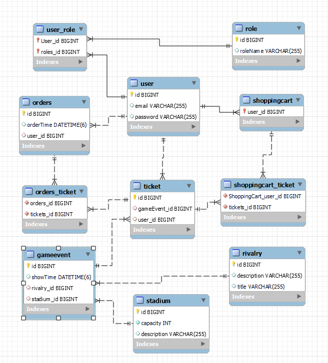

## FOOTBALL-TICKETS-APP

#General info
Football-tickets-app is a REST-full web application that provides functionality of on-line purchasing
football games tickets. 
Because the project doesn't have interactive UI part, to test its
functionality different testing client-server tools like Postman, Insomnia can be used. 

#Technologies
List of used technologies:
* Apache Maven 
* Git 
* Hibernate 5  
* IntelliJ IDEA 2021.1.1 (Ultimate Edition)
* JDK 11
* Lombok   
* MySQL 8.0
* OS Windows 8.1
* Passay  
* Spring frameworks (Webmvc, Security) 5  
* SQL
* Tomcat 9

#Installation
Application can be launched on a computer that has JRE (JDK 11), IDE, Maven, Tomcat and MySQL Workbench
installed.

These are steps to deploy the project on your computer using IntelliJ IDEA:

1.Create new project by cloning this repository: `File`->`New`->`Project from version control` and
insert URL _https://github.com/fotomassimo/football-tickets-app.git_.

2.Setup web server Tomcat: `Run`->`Edit Configurations`, click `+` (or press `Alt+Insert`on Windows) to
`Add new Configurtion`, type `tomcat` and select `Tomcat Server`->`Local`. In the following menu
insert _http://localhost:8080/_ for `URL`, 8080 for `Http port`, v. 11 for `JRE` and press `Fix`.
In the next menu `Select artifact to deploy`->`football-tickets-app:war exploded` and insert only `/`
for `Application context`, press`Ok`.

3.Setup database: in `MySQL Workbench` create and open new connection with your credentials or use
the existing one, open file `src/main/resources/init_db.sql` from the folder of this project
on your computer `File`->`Open SQL script` (or press `Ctrl+Shift+O` on Windows) and execute this
script `Query`->`Execute (All or Selection)` (or press `Ctrl+Shift+Enter` on Windows).

4.Setup database connection properties: Open file `src/main/resources/mysql_db.properties` in this
project using IDE and set values `user`, `password` and localhost port value according to the
credentials from your MySQL connection.

5.Deploy the project on the web server using IDE: `Run`->`Run`(or press `Shift+F10` on Windows).

To use another DBMS that supports SQL script you have to create new file in `src/main/resources/`
folder with the same structure and extension as `mysql_db.properties` and set values in compliance with
the DBMS vendor official documentation. Then change value "classpath:" of the annotation @PropertySource
in the file `src/main/java/football/tickets/app/config/AppConfig.java` to the name of your custom file.

#Usage
The main entities of the application are:
* User as a ticket-shop customer, that can have different roles(permissions);
* Shopping cart where user can hold ordered tickets; 
* Order which user completes after selecting tickets;
* Rivalry as a description of competing teams;
* Stadium as a location where the game will take place;
* GameEvent that holds information about certain teams, time and place where they will meet;
* Tickets with information about their owner and event.

Your web browser after successful deployment will automatically open the starting login page of the
application. For the initial login use credentials of the first initialized in the database user from the file
`src/main/java/football/tickets/app/config/DataInitializer.java`. It has "ADMIN" level of access to the endpoints.
Your can also register a new user sending POST request to the endpoint http://localhost:8080/register with
new credentials in JSON format like `{"email":"user@user.com", "password":"12345678", "repeatPassword":"12345678"}`.
Every new user has the default "USER" access level.  

"USER" has following options: 
* Display all stadiums, rivalries, available game-events, orders history;
* Add tickets in his shopping cart;
* Complete order of all tickets stored in the cart;
 
The diagram below shows entities of objects that we can create and manage in this
application, their parameters and relations between them.

